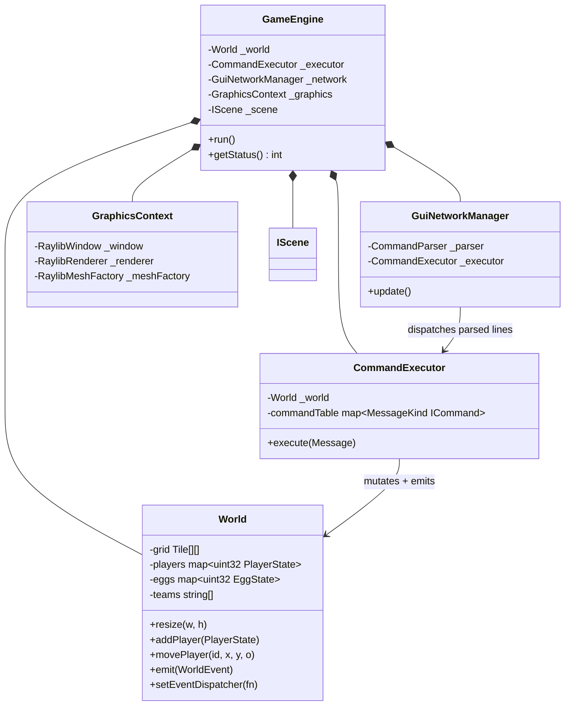
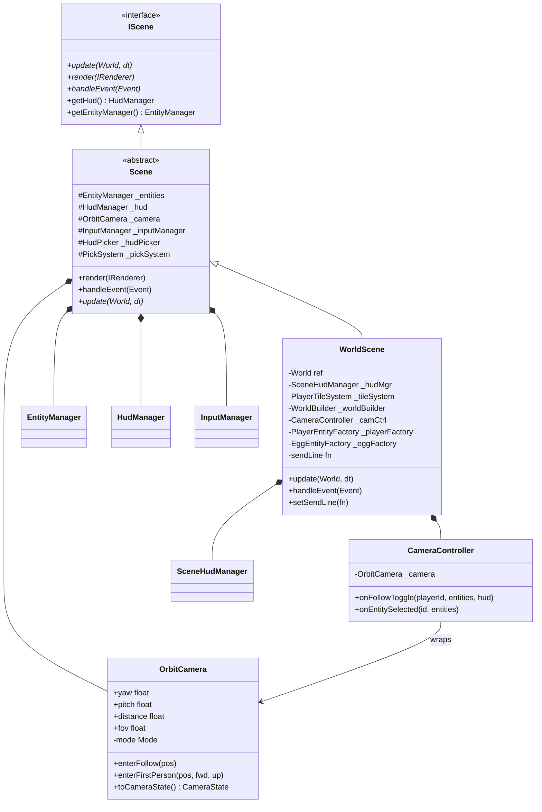
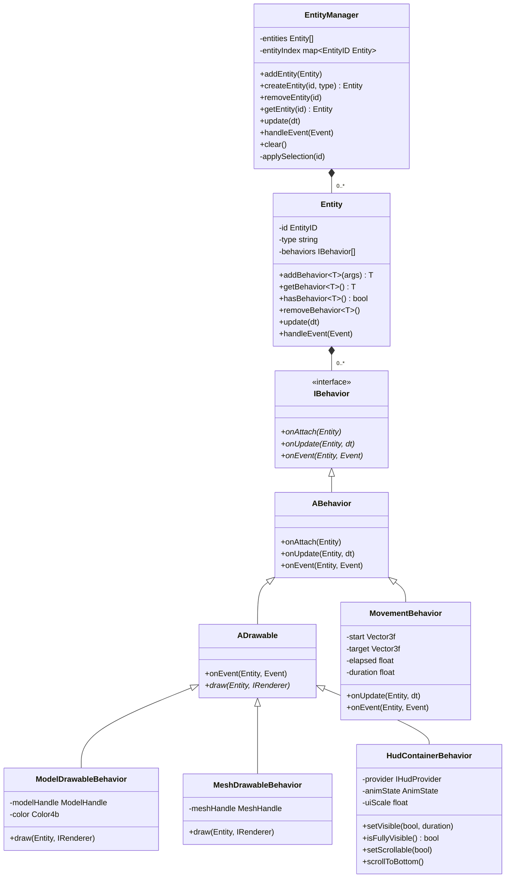
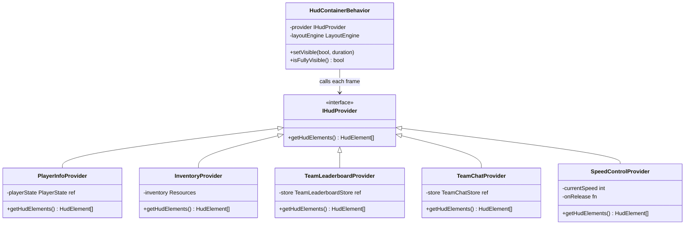
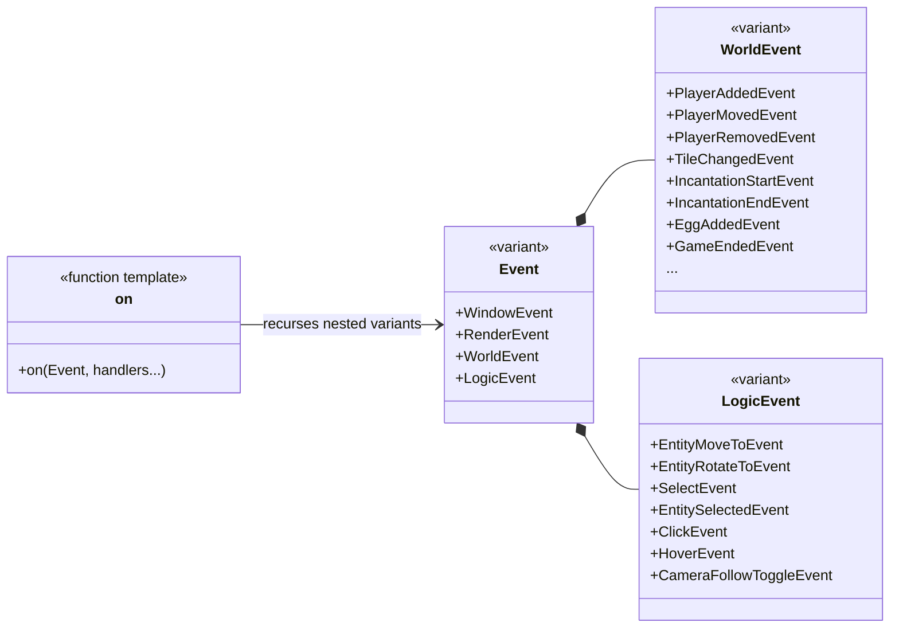
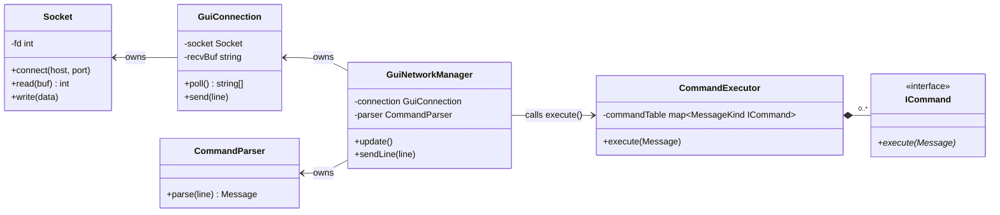
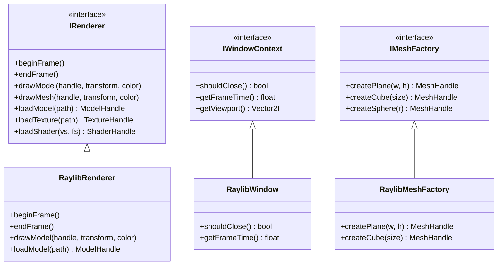

# Class Diagram

## Core architecture

```mermaid
classDiagram
    direction TB

    class GameEngine {
        -World _world
        -CommandExecutor _executor
        -GuiNetworkManager _network
        -GraphicsContext _graphics
        -IScene _scene
        +run()
        +getStatus() int
    }

    class World {
        -grid Tile[][]
        -players map~uint32 PlayerState~
        -eggs map~uint32 EggState~
        -teams string[]
        +resize(w, h)
        +addPlayer(PlayerState)
        +movePlayer(id, x, y, o)
        +emit(WorldEvent)
        +setEventDispatcher(fn)
    }

    class CommandExecutor {
        -World _world
        -commandTable map~MessageKind ICommand~
        +execute(Message)
    }

    class GuiNetworkManager {
        -CommandParser _parser
        -CommandExecutor _executor
        +update()
    }

    class GraphicsContext {
        -RaylibWindow _window
        -RaylibRenderer _renderer
        -RaylibMeshFactory _meshFactory
    }

    GameEngine *-- World
    GameEngine *-- CommandExecutor
    GameEngine *-- GuiNetworkManager
    GameEngine *-- GraphicsContext
    GameEngine *-- IScene
    CommandExecutor --> World : mutates + emits
    GuiNetworkManager --> CommandExecutor : dispatches parsed lines
```

## Scene hierarchy

```mermaid
classDiagram
    direction TB

    class IScene {
        <<interface>>
        +update(World, dt)*
        +render(IRenderer)*
        +handleEvent(Event)*
        +getHud() HudManager
        +getEntityManager() EntityManager
    }

    class Scene {
        <<abstract>>
        #EntityManager _entities
        #HudManager _hud
        #OrbitCamera _camera
        #InputManager _inputManager
        #HudPicker _hudPicker
        #PickSystem _pickSystem
        +render(IRenderer)
        +handleEvent(Event)
        +update(World, dt)*
    }

    class WorldScene {
        -World ref
        -SceneHudManager _hudMgr
        -PlayerTileSystem _tileSystem
        -WorldBuilder _worldBuilder
        -CameraController _camCtrl
        -PlayerEntityFactory _playerFactory
        -EggEntityFactory _eggFactory
        -sendLine fn
        +update(World, dt)
        +handleEvent(Event)
        +setSendLine(fn)
    }

    class OrbitCamera {
        +yaw float
        +pitch float
        +distance float
        +fov float
        -mode Mode
        +enterFollow(pos)
        +enterFirstPerson(pos, fwd, up)
        +toCameraState() CameraState
    }

    class CameraController {
        -OrbitCamera _camera
        +onFollowToggle(playerId, entities, hud)
        +onEntitySelected(id, entities)
    }

    IScene <|-- Scene
    Scene <|-- WorldScene
    Scene *-- OrbitCamera
    Scene *-- EntityManager
    Scene *-- HudManager
    Scene *-- InputManager
    WorldScene *-- CameraController
    WorldScene *-- SceneHudManager
    CameraController --> OrbitCamera : wraps
```

## Entity & Behavior system

```mermaid
classDiagram
    direction TB

    class EntityManager {
        -entities Entity[]
        -entityIndex map~EntityID Entity~
        +addEntity(Entity)
        +createEntity(id, type) Entity
        +removeEntity(id)
        +getEntity(id) Entity
        +update(dt)
        +handleEvent(Event)
        +clear()
        -applySelection(id)
    }

    class Entity {
        -id EntityID
        -type string
        -behaviors IBehavior[]
        +addBehavior~T~(args) T
        +getBehavior~T~() T
        +hasBehavior~T~() bool
        +removeBehavior~T~()
        +update(dt)
        +handleEvent(Event)
    }

    class IBehavior {
        <<interface>>
        +onAttach(Entity)*
        +onUpdate(Entity, dt)*
        +onEvent(Entity, Event)*
    }

    class ABehavior {
        +onAttach(Entity)
        +onUpdate(Entity, dt)
        +onEvent(Entity, Event)
    }

    class ADrawable {
        +onEvent(Entity, Event)
        +draw(Entity, IRenderer)*
    }

    class ModelDrawableBehavior {
        -modelHandle ModelHandle
        -color Color4b
        +draw(Entity, IRenderer)
    }

    class MeshDrawableBehavior {
        -meshHandle MeshHandle
        +draw(Entity, IRenderer)
    }

    class HudContainerBehavior {
        -provider IHudProvider
        -animState AnimState
        -uiScale float
        +setVisible(bool, duration)
        +isFullyVisible() bool
        +setScrollable(bool)
        +scrollToBottom()
    }

    class MovementBehavior {
        -start Vector3f
        -target Vector3f
        -elapsed float
        -duration float
        +onUpdate(Entity, dt)
        +onEvent(Entity, Event)
    }

    EntityManager *-- "0..*" Entity
    Entity *-- "0..*" IBehavior
    IBehavior <|-- ABehavior
    ABehavior <|-- ADrawable
    ADrawable <|-- ModelDrawableBehavior
    ADrawable <|-- MeshDrawableBehavior
    ADrawable <|-- HudContainerBehavior
    ABehavior <|-- MovementBehavior
```

## HUD provider pattern

```mermaid
classDiagram
    direction TB

    class IHudProvider {
        <<interface>>
        +getHudElements() HudElement[]
    }

    class HudContainerBehavior {
        -provider IHudProvider
        -layoutEngine LayoutEngine
        +setVisible(bool, duration)
        +isFullyVisible() bool
    }

    class PlayerInfoProvider {
        -playerState PlayerState ref
        +getHudElements() HudElement[]
    }

    class InventoryProvider {
        -inventory Resources
        +getHudElements() HudElement[]
    }

    class TeamLeaderboardProvider {
        -store TeamLeaderboardStore ref
        +getHudElements() HudElement[]
    }

    class TeamChatProvider {
        -store TeamChatStore ref
        +getHudElements() HudElement[]
    }

    class SpeedControlProvider {
        -currentSpeed int
        -onRelease fn
        +getHudElements() HudElement[]
    }

    IHudProvider <|-- PlayerInfoProvider
    IHudProvider <|-- InventoryProvider
    IHudProvider <|-- TeamLeaderboardProvider
    IHudProvider <|-- TeamChatProvider
    IHudProvider <|-- SpeedControlProvider
    HudContainerBehavior --> IHudProvider : calls each frame
```

## Event system

```mermaid
classDiagram
    direction LR

    class Event {
        <<variant>>
        +WindowEvent
        +RenderEvent
        +WorldEvent
        +LogicEvent
    }

    class WorldEvent {
        <<variant>>
        +PlayerAddedEvent
        +PlayerMovedEvent
        +PlayerRemovedEvent
        +TileChangedEvent
        +IncantationStartEvent
        +IncantationEndEvent
        +EggAddedEvent
        +GameEndedEvent
        ...
    }

    class LogicEvent {
        <<variant>>
        +EntityMoveToEvent
        +EntityRotateToEvent
        +SelectEvent
        +EntitySelectedEvent
        +ClickEvent
        +HoverEvent
        +CameraFollowToggleEvent
    }

    class on {
        <<function template>>
        +on(Event, handlers...)
    }

    Event *-- WorldEvent
    Event *-- LogicEvent
    on --> Event : recurses nested variants
```

## Network pipeline

```mermaid
classDiagram
    direction LR

    class Socket {
        -fd int
        +connect(host, port)
        +read(buf) int
        +write(data)
    }

    class GuiConnection {
        -socket Socket
        -recvBuf string
        +poll() string[]
        +send(line)
    }

    class GuiNetworkManager {
        -connection GuiConnection
        -parser CommandParser
        +update()
        +sendLine(line)
    }

    class CommandParser {
        +parse(line) Message
    }

    class CommandExecutor {
        -commandTable map~MessageKind ICommand~
        +execute(Message)
    }

    class ICommand {
        <<interface>>
        +execute(Message)*
    }

    Socket <-- GuiConnection : owns
    GuiConnection <-- GuiNetworkManager : owns
    CommandParser <-- GuiNetworkManager : owns
    GuiNetworkManager --> CommandExecutor : calls execute()
    CommandExecutor *-- "0..*" ICommand
```

## Graphics abstraction

```mermaid
classDiagram
    direction TB

    class IRenderer {
        <<interface>>
        +beginFrame()
        +endFrame()
        +drawModel(handle, transform, color)
        +drawMesh(handle, transform, color)
        +loadModel(path) ModelHandle
        +loadTexture(path) TextureHandle
        +loadShader(vs, fs) ShaderHandle
    }

    class IWindowContext {
        <<interface>>
        +shouldClose() bool
        +getFrameTime() float
        +getViewport() Vector2f
    }

    class IMeshFactory {
        <<interface>>
        +createPlane(w, h) MeshHandle
        +createCube(size) MeshHandle
        +createSphere(r) MeshHandle
    }

    class RaylibRenderer {
        +beginFrame()
        +endFrame()
        +drawModel(handle, transform, color)
        +loadModel(path) ModelHandle
    }

    class RaylibWindow {
        +shouldClose() bool
        +getFrameTime() float
    }

    class RaylibMeshFactory {
        +createPlane(w, h) MeshHandle
        +createCube(size) MeshHandle
    }

    IRenderer <|-- RaylibRenderer
    IWindowContext <|-- RaylibWindow
    IMeshFactory <|-- RaylibMeshFactory
```
