# Class Diagram

## Core architecture

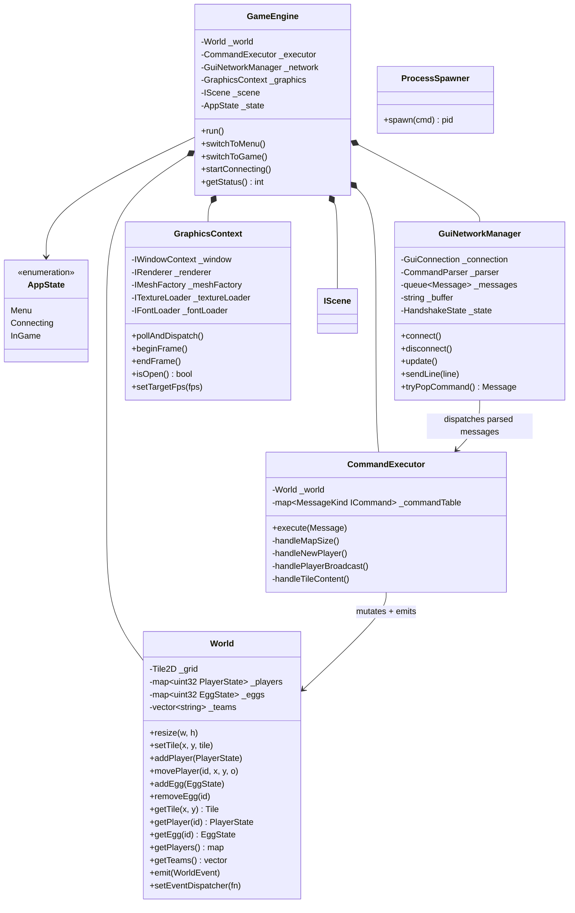

## Scene hierarchy

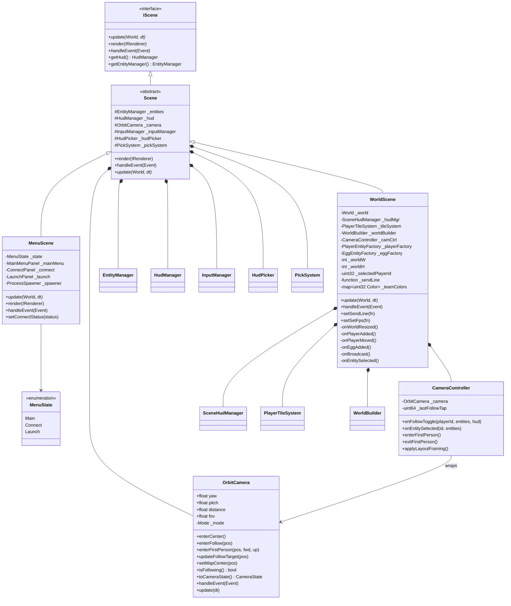

## Entity & Behavior system

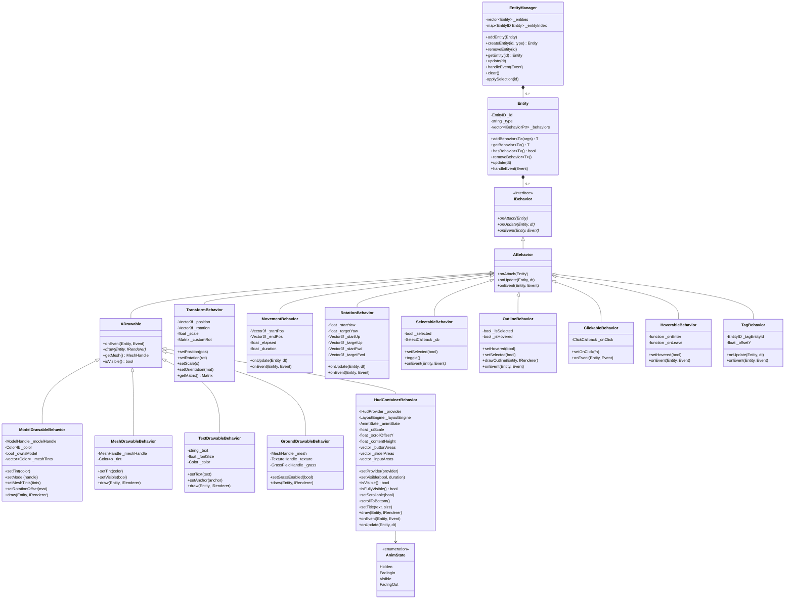

## Player-specific behaviors

```mermaid
classDiagram
    direction TB

    class PlayerBehavior {
        -uint32 _playerId
        -int _x
        -int _y
        -int _orientation
        -int _level
        -string _team
        -Resources _inventory
        +playerId() uint32
        +x() int
        +y() int
        +orientation() int
        +level() int
        +team() string
        +inventory() Resources
    }

    class PlayerAnimationBehavior {
        -int _frame
        -int _animIndex
        -float _moveDuration
        -bool _running
        -bool _takePlaying
        -bool _dancing
        +onUpdate(Entity, dt)
        +onEvent(Entity, Event)
    }

    class PlayerLevelModelBehavior {
        -ModelHandle[8] _levelModels
        -vector[8] _skinMeshIndices
        +onEvent(Entity, Event)
    }

    class BroadcastBehavior {
        -float _timeLeft
        -bool _active
        +onUpdate(Entity, dt)
        +onEvent(Entity, Event)
    }

    class ResourceBehavior {
        -int _x
        -int _y
        -int _type
        -int _count
        +getX() int
        +getY() int
        +getType() int
        +getCount() int
        +onEvent(Entity, Event)
    }

    class EggBehavior {
        -float _time
        -bool _pendingRemoval
        -float _removeTimer
        +onUpdate(Entity, dt)
        +onEvent(Entity, Event)
    }

    class RitualCircleBehavior {
        -MeshHandle _mesh
        -Vector3f _center
        -Vector3f _normal
        +onUpdate(Entity, dt)
        +onEvent(Entity, Event)
    }

    class IncantationTileBehavior {
        -float _time
        -float _flashTimer
        -bool _active
        +onUpdate(Entity, dt)
        +onEvent(Entity, Event)
    }

    class ExplosionBehavior {
        -Phase _phase
        -vector~Spark~ _sparks
        +onUpdate(Entity, dt)
        +onEvent(Entity, Event)
    }

    class WaveBroadcastBehavior {
        -float _radius
        -float _maxRadius
        -bool _active
        +onUpdate(Entity, dt)
        +onEvent(Entity, Event)
    }

    ABehavior <|-- PlayerBehavior
    ABehavior <|-- PlayerAnimationBehavior
    ABehavior <|-- PlayerLevelModelBehavior
    ABehavior <|-- BroadcastBehavior
    ABehavior <|-- ResourceBehavior
    ABehavior <|-- EggBehavior
    ABehavior <|-- RitualCircleBehavior
    ABehavior <|-- IncantationTileBehavior
    ABehavior <|-- ExplosionBehavior
    ABehavior <|-- WaveBroadcastBehavior
```

## HUD provider pattern

```mermaid
classDiagram
    direction TB

    class IHudProvider {
        <<interface>>
        +getHudElements() vector~HudElement~*
        +getVersion() uint64
    }

    class HudElement {
        -HudElementData _data
    }

    class HudElementData {
        <<variant>>
        +TextData
        +BarData
        +RectData
        +ButtonData
        +ChatBubbleData
        +ImageData
        +SliderData
        +SlotData
    }

    class PlayerInfoProvider {
        -PlayerState _playerState
        +getHudElements() vector~HudElement~
    }

    class InventoryProvider {
        -Resources _inventory
        +getHudElements() vector~HudElement~
    }

    class TeamLeaderboardProvider {
        -TeamLeaderboardStore _store
        +getHudElements() vector~HudElement~
    }

    class TeamChatProvider {
        -TeamChatStore _store
        +getHudElements() vector~HudElement~
    }

    class SpeedControlProvider {
        -int _currentSpeed
        -function _onRelease
        -function _onChange
        +getHudElements() vector~HudElement~
    }

    class NotificationPopupProvider {
        -string _icon
        -string _title
        -string _subtitle
        +getHudElements() vector~HudElement~
    }

    class PlayerTagProvider {
        -string _name
        -Color _teamColor
        -bool _isBroadcasting
        +getHudElements() vector~HudElement~
    }

    class ResourceInfoProvider {
        -Tile _tile
        +getHudElements() vector~HudElement~
    }

    class LeaderboardControlProvider {
        -int _page
        -function _onPrev
        -function _onNext
        -function _onWorldInfo
        +getHudElements() vector~HudElement~
    }

    class TeamDetailProvider {
        -vector _players
        -function _onFollowClick
        +getHudElements() vector~HudElement~
    }

    class SettingsProvider {
        -vector _sections
        +getHudElements() vector~HudElement~
    }

    class ClockProvider {
        -float _uptimeSeconds
        -int _timeUnit
        +getHudElements() vector~HudElement~
    }

    class WorldInfoProvider {
        -World _world
        +getHudElements() vector~HudElement~
    }

    class MainMenuProvider {
        -function _onConnect
        -function _onLaunch
        -function _onQuit
        +getHudElements() vector~HudElement~
    }

    class ConnectProvider {
        -string _host
        -string _port
        -string _status
        -function _onConnect
        +getHudElements() vector~HudElement~
    }

    class LaunchProvider {
        -function _onLaunch
        +getHudElements() vector~HudElement~
    }

    IHudProvider <|-- PlayerInfoProvider
    IHudProvider <|-- InventoryProvider
    IHudProvider <|-- TeamLeaderboardProvider
    IHudProvider <|-- TeamChatProvider
    IHudProvider <|-- SpeedControlProvider
    IHudProvider <|-- NotificationPopupProvider
    IHudProvider <|-- PlayerTagProvider
    IHudProvider <|-- ResourceInfoProvider
    IHudProvider <|-- LeaderboardControlProvider
    IHudProvider <|-- TeamDetailProvider
    IHudProvider <|-- SettingsProvider
    IHudProvider <|-- ClockProvider
    IHudProvider <|-- WorldInfoProvider
    IHudProvider <|-- MainMenuProvider
    IHudProvider <|-- ConnectProvider
    IHudProvider <|-- LaunchProvider
    HudContainerBehavior --> IHudProvider : calls each frame
    IHudProvider --> HudElement : returns
    HudElement --> HudElementData : wraps
```

## HUD panels

```mermaid
classDiagram
    direction TB

    class SceneHudManager {
        -LeaderboardPanel _leaderboard
        -TeamDetailPanel _teamDetail
        -ChatPanel _chat
        -PlayerInfoPanel _playerInfo
        -PopupPanel _popup
        -ResourceInfoPanel _resourceInfo
        -SpeedPanel _speed
        -SettingsPanel _settings
        -InventoryPanel _inventory
        -ClockPanel _clock
        -TeamStatsPanel _teamStats
        -WorldInfoPanel _worldInfo
        +setup(hud, entities, ...)
        +onTeamAdded(team)
        +onPlayerAdded(player)
        +onPlayerLevelChanged(id, level)
        +onBroadcast(id, msg)
        +onEntitySelected(id)
    }

    class LeaderboardPanel {
        -TeamLeaderboardStore _lbStore
        -map _providers
        -map _containers
        +setup(hud, entities)
        +onTeamAdded(team)
        +onPlayerAdded(player)
        +onPlayerLevelChanged(id, level)
        +toggle()
        +setOnDetailsClick(fn)
        +setVotedTeam(team)
    }

    class TeamDetailPanel {
        -TeamDetailProvider _provider
        +setup(hud)
        +open(team, players)
        +refreshIfOpen(players)
        +close()
        +setOnFollowClick(fn)
    }

    class PlayerInfoPanel {
        -PlayerInfoProvider _provider
        +setup(hud)
        +show(player)
        +clear()
        +setOnChatClick(fn)
        +setVotedTeam(team)
    }

    class ChatPanel {
        -TeamChatStore _chatStore
        -TeamChatProvider _provider
        +setup(hud)
        +open(team)
        +close()
        +onBroadcast(id, team, msg)
        +setPlayerTeam(id, team)
        +removePlayer(id)
    }

    class InventoryPanel {
        -InventoryProvider _provider
        -uint32 _selectedPlayerId
        +setup(hud)
        +show()
        +hide()
        +toggle()
        +setSelectedPlayer(id)
        +onInventoryChanged(id, inv)
    }

    class PopupPanel {
        -NotificationPopupProvider[3] _providers
        +setup(hud)
        +push(icon, title, subtitle)
        +tick(dt)
    }

    class SpeedPanel {
        -SpeedControlProvider _provider
        +setup(hud)
        +setSendLine(fn)
        +setTimeUnit(tu)
    }

    class SettingsPanel {
        -SettingsProvider _provider
        +setup(hud, inputMgr)
        +toggle()
    }

    class ResourceInfoPanel {
        -ResourceInfoProvider _provider
        +setup(hud)
        +show(tile)
        +hide()
    }

    class ClockPanel {
        -ClockProvider _provider
        +setup(hud)
        +setUptime(s)
        +setTimeUnit(tu)
        +tick(dt)
    }

    class TeamStatsPanel {
        +setup(hud)
        +show(team)
        +hide()
        +isVisible() bool
    }

    class WorldInfoPanel {
        -WorldInfoProvider _provider
        +setup(hud)
        +show()
        +hide()
        +toggle()
    }

    SceneHudManager *-- LeaderboardPanel
    SceneHudManager *-- TeamDetailPanel
    SceneHudManager *-- PlayerInfoPanel
    SceneHudManager *-- ChatPanel
    SceneHudManager *-- InventoryPanel
    SceneHudManager *-- PopupPanel
    SceneHudManager *-- SpeedPanel
    SceneHudManager *-- SettingsPanel
    SceneHudManager *-- ResourceInfoPanel
    SceneHudManager *-- ClockPanel
    SceneHudManager *-- TeamStatsPanel
    SceneHudManager *-- WorldInfoPanel
```

## Entity builder pattern

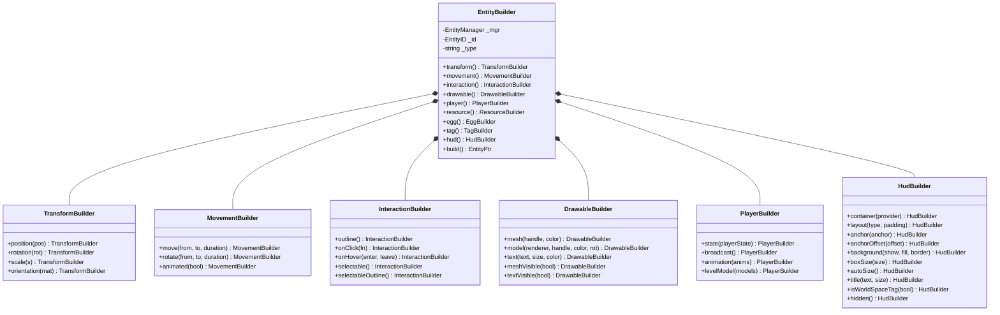

## Factory system

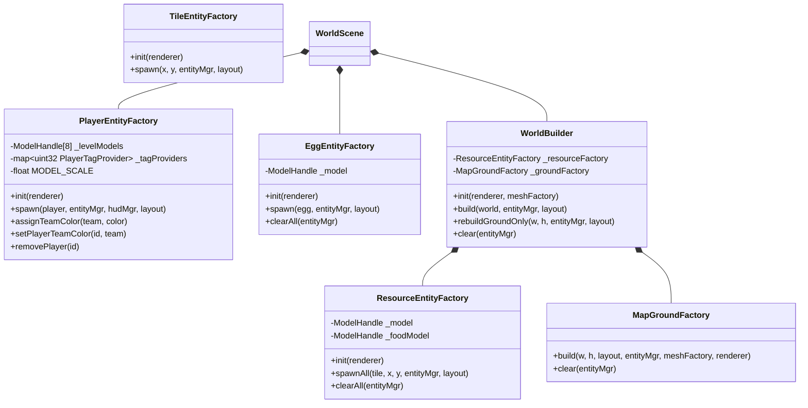

## Map layout system

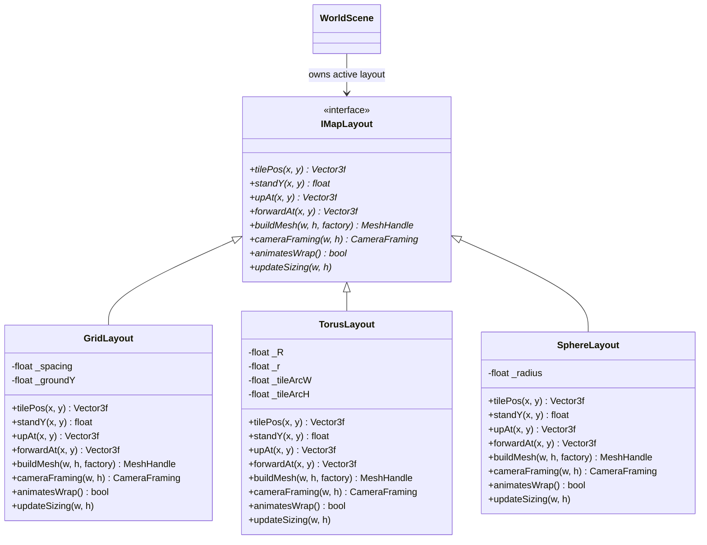

## Player tile & world systems

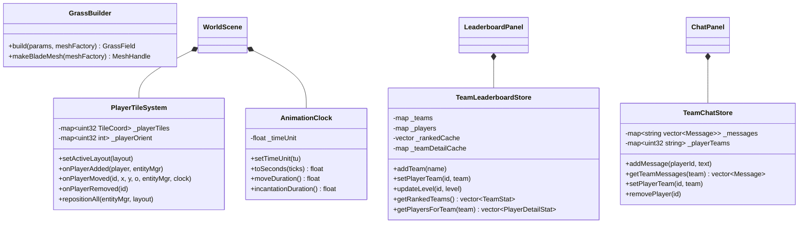

## Event system

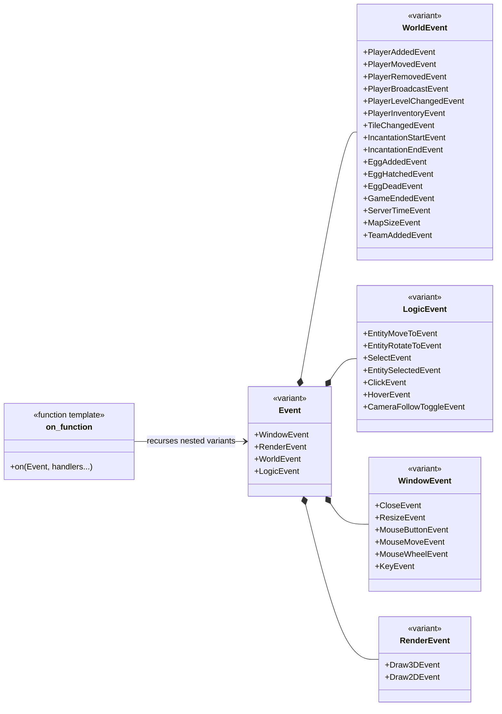

## Network pipeline

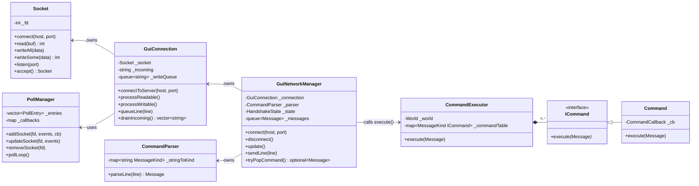

## Graphics abstraction

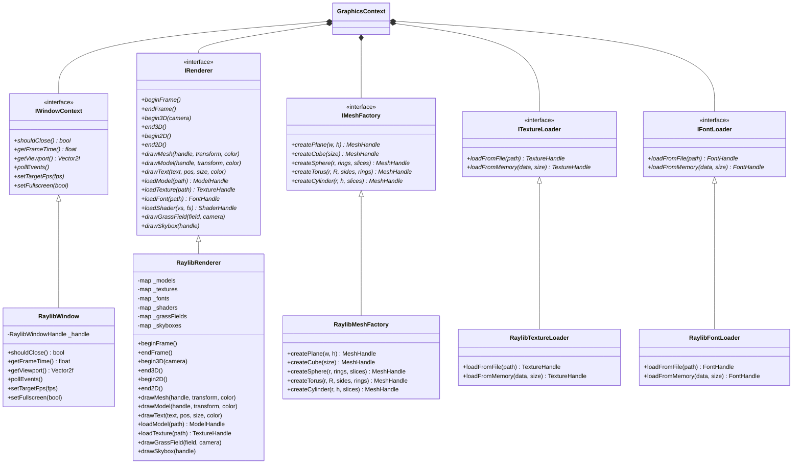

## Input & picking system

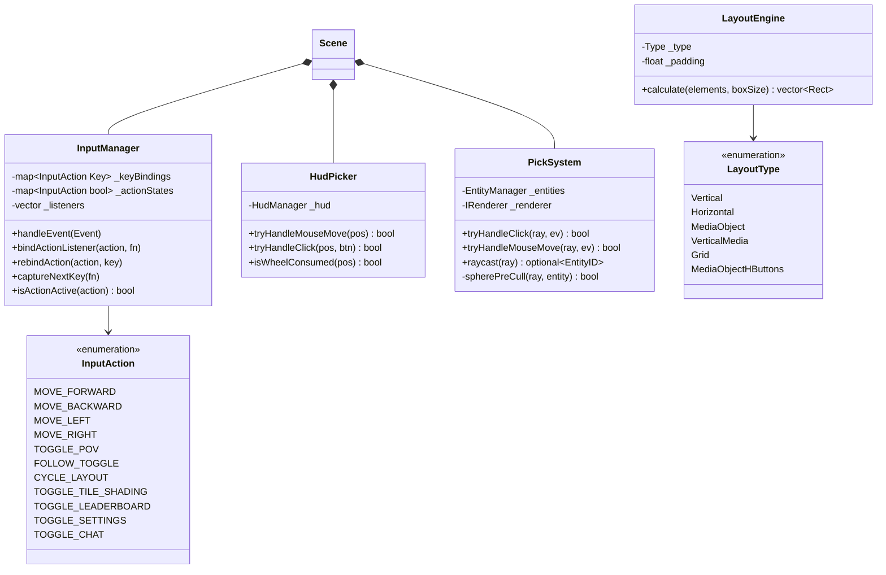

## Logging & service locator

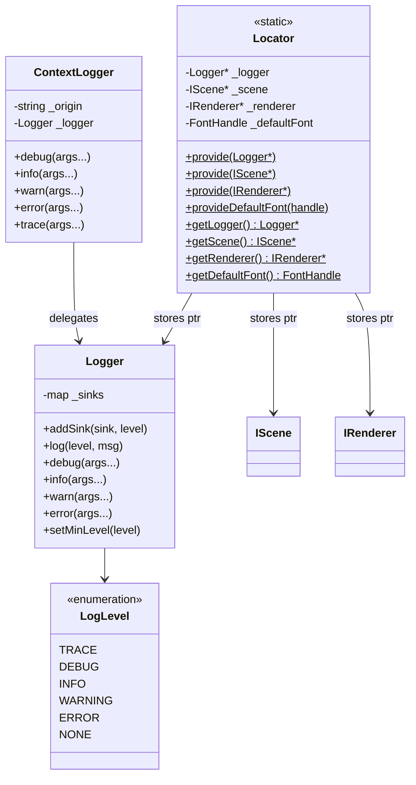
